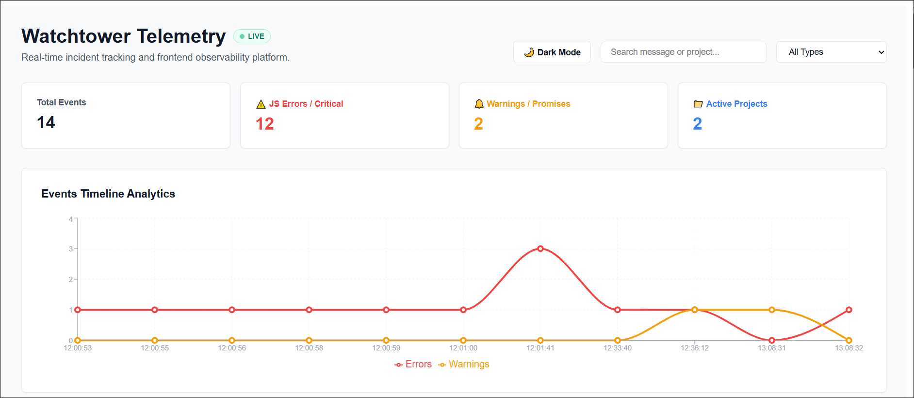

# Watchtower


Real-time frontend observability and telemetry platform built with **Next.js**, **Express**, **Socket.io**, **Prisma**, and **PostgreSQL**.

Watchtower captures frontend runtime errors, warnings, and custom events through a custom SDK and streams them to a centralized dashboard in real time. The platform provides live monitoring, analytics, and event investigation capabilities for modern web applications.

---

## 🚀 Live Demo

🌐 Live Dashboard: https://watchtower-jt43.vercel.app/

---

## 📸 Screenshots

### Dashboard Overview



---

## ✨ Features

### 🔍 Custom Telemetry SDK

- JavaScript runtime error tracking
- Unhandled Promise rejection tracking
- Custom event logging
- API key authentication

### ⚡ Real-Time Monitoring

- Socket.io powered event streaming
- Instant dashboard updates
- Live connection status indicator
- Toast notifications
- No page refresh required

### 📊 Analytics Dashboard

- Event timeline visualization
- Error and warning statistics
- Active project tracking
- Event filtering
- Event search
- Stack trace inspection

### 🛡️ Backend Infrastructure

- REST API for telemetry ingestion
- Prisma ORM
- PostgreSQL database
- API key middleware protection
- Real-time event broadcasting

---

## 🛠 Tech Stack

### Frontend

- Next.js 14
- React
- TypeScript
- Tailwind CSS
- Recharts
- Socket.io Client

### Backend

- Node.js
- Express
- Socket.io
- Prisma ORM

### Database

- PostgreSQL
- Neon PostgreSQL

### Monorepo

- Turborepo
- PNPM Workspaces

---

## 🏗 Architecture Overview

```txt
Client Application
       │
       ▼
Custom Watchtower SDK
       │
       ▼
Express API Server ──(Real-time via Socket.io)──► Next.js Dashboard
       │                                                 ▲
       ▼                                                 │
PostgreSQL Database ───────(Initial Fetch via API)────────┘
```

---

## 📁 Project Structure

```txt
watchtower/
│
├── apps/
│   ├── api/          # Express API server with Prisma & WebSockets
│   └── dashboard/    # Next.js Telemetry Analytics UI
│
├── packages/
│   ├── sdk/          # Client-side integration tracker
│   └── shared/       # Shared types and utilities
│
├── turbo.json        # Turborepo build pipeline configuration
└── package.json      # Root dependencies and workspaces
```

---

## ⚙️ Environment Variables

### apps/api/.env

```env
PORT=3001
FRONTEND_URL=http://localhost:3000
WATCHTOWER_API_KEY=your_secret_key
DATABASE_URL=your_postgresql_connection_string
```

### apps/dashboard/.env.local

```env
NEXT_PUBLIC_API_URL=http://localhost:3001
```

---

## 🚀 Local Development

## 🚀 Local Development

### 1. Clone the repository

```bash
git clone https://github.com/ferda-zeynep/watchtower.git
cd watchtower
```

### 2. Install dependencies

```bash
npm install
```

### 3. Run database migrations

```bash
npx prisma migrate dev
```

### 4. Start development servers

```bash
npm run dev
```

## 🎯 Why I Built This

Most portfolio projects focus on CRUD operations, admin dashboards, or AI integrations.

With Watchtower, I wanted to explore how observability platforms such as Sentry, LogRocket, and Datadog collect, process, and visualize telemetry data in real time.

The project helped me gain practical experience with:

- Real-time systems
- WebSocket communication
- Custom SDK development
- Backend architecture
- Database design
- Monorepo management
- Observability concepts

---

## 🔮 Future Improvements

- Error grouping and fingerprinting
- User authentication
- Alerting system
- Email notifications
- Performance metrics collection
- User session tracking
- Advanced analytics
- Multi-project support

---

## 📄 License

MIT License

```

```
